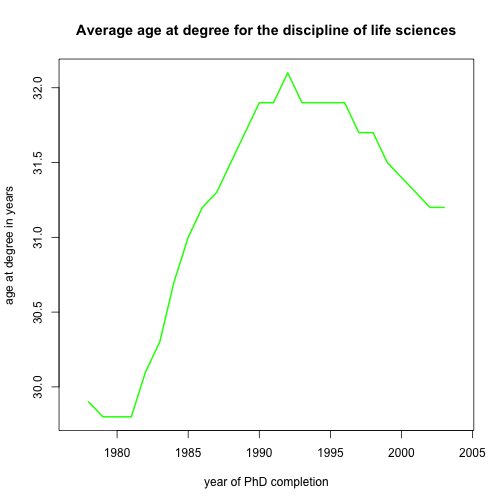

How long does a PhD take?
========================================================
author: Onna Nelson (wugology)
date: February 2015

Why is this question important?
========================================================

The question of how long a PhD takes to complete is important for:

- **Grant agencies**, to know how much funding to provide PhD students
- **University professors**, to advise students about degree expectations
- **Seniors and alumni**, to be better informed when considering grad school

What are the misconceptions?
========================================================

- Many people believe a PhD is like other degree programs, with **a set start and end date**.
- Many funding agencies and universities only guarantee a student funding for their first **five years** of graduate school, suggesting this is a **reasonable time to degree**.
- The reality is that the **average registered time to degree** across disciplines is over 7 years (and increasing)!

How do you use this app?
========================================================
- First, choose the broad discipline you're interested in. For example, if you're in biology, choose "life sciences."
- Next, choose the measure of time: **time to degree** (the time between undergraduate graduation and PhD graduation), **registered time to degree** (the time enrolled in a PhD program), or **age** (age of the PhD recipient at graduation).
- Finally, you can optionally choose a color! 
- The app will automatically update with a new graph.

Average age of life science PhD graduates
========================================================
- This example shows "life sciences" as the discipline, "age" as the measure of time, and "green" as the color.
 

Be sure to try the app out youself!
========================================================
You can investigate how long a PhD takes for yourself by visiting <a href="https://wugology.shinyapps.io/DataProduct/">https://wugology.shinyapps.io/DataProduct/</a>
